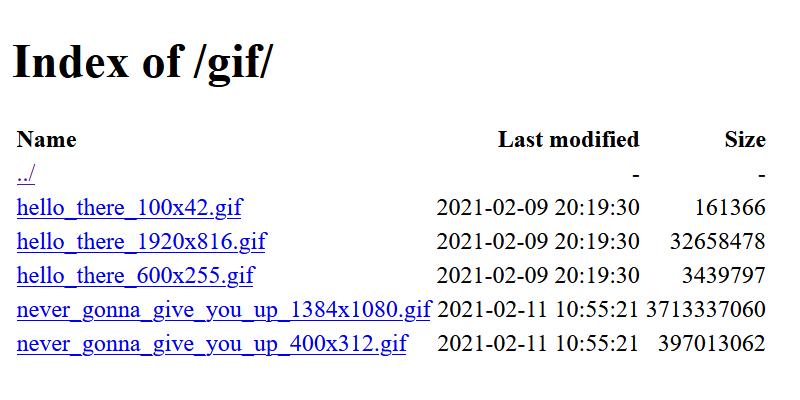

# S3 Directory Listing
Another poorly written Flask app, but this one makes boring directory listings from S3 buckets, aye!

### `config.json`
```json
{
    "endpoint_url": "https://fra1.digitaloceanspaces.com",
    "access_key_id": "someaccesskeyid",
    "secret_access_key": "somesecretaccesskey",
    "bucket_url": "https://example.fra1.digitaloceanspaces.com",
    "bucket_name": "example"
}

```

### Example

